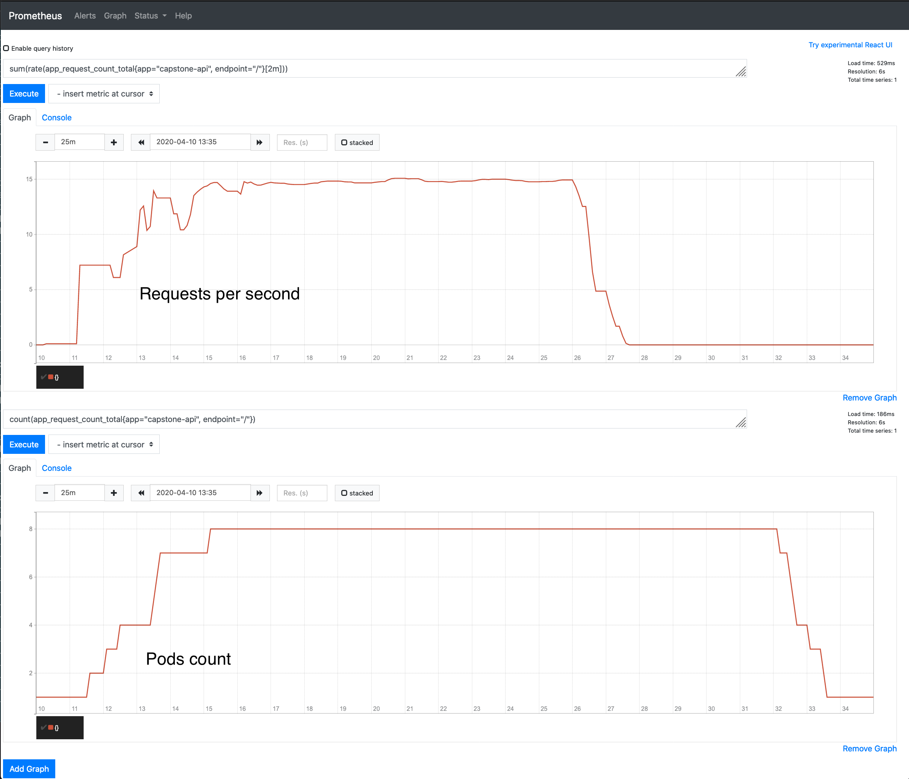
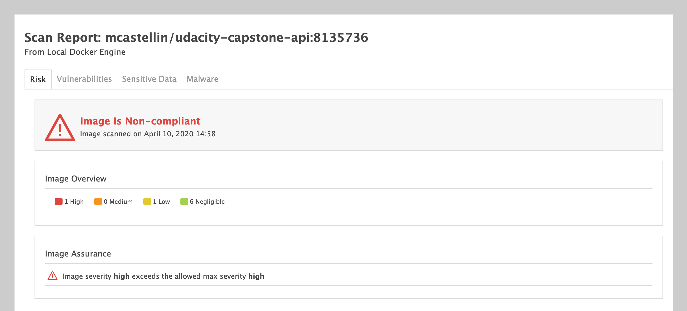
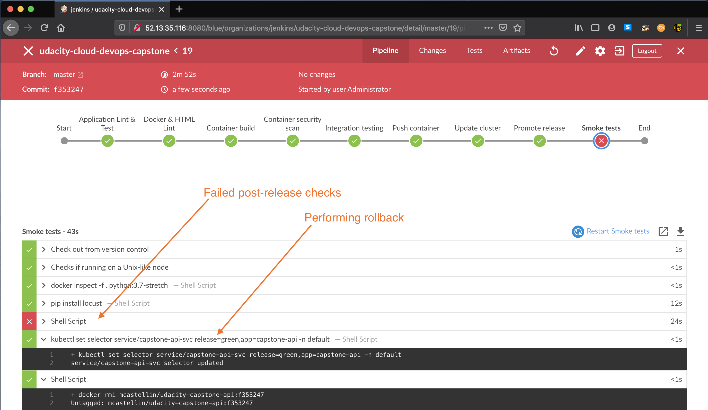

# Udacity Cloud DevOps Nanodegree Capstone Project
In this project combines all the skills learned in the Udacity's Cloud DevOps nanodegree program to build
an automated CI-CD pipeline that deploys a Python application into a Kubernetes cluster hosted with AWS EKS.

Every code change pushed into this repository is validated by a Jenkins pipeline. 
The `master` branch is considered the desired state of the deployed application and as soon as all validation steps
are a pass, the application is deployed into the Kubernetes cluster in a Blue-Green fashion.
Below are the stages the application has to pass that lead to a successful deployment:

- Static code validation (linting): python, html and Dockerfiles
- Build and unit testing run
- Docker container build
- Container scan for vulnerabilities
- Integration testing

When all the checks above complete successfully for the `master` branch, the container is promoted to **release candidate**
and a deployment is attempted:

- Push container to Docker registry
- Create a *blue* or *green* deployment in Kubernetes
- Smoke testing to validate and warm up the new deployment
- Promote successful release
- Tag new container as latest in DockerHub


## The Application

The application is a simple API written in Python that translates date references expressed in natural language to
a exact date-time values. A user can make a POST request to the `/translate` endpoint and request to translate, say 
`in three days`, and receive in response a date time value for that expression

```
Request: POST http://{{application_url}}/translate:
{
    "text": "in three days"
}
```

```
Response body:
{
    "result": "2020-04-13 12:39"
}
```


### High Availability

The application is hosted in a Kubernetes cluster designed for high availability. The cluster has three nodes hosted in EC2 instances
covering different AZs (Availability Zones) in the AWS VPC.


### Scalability

By running the application with the Kubernetes orchestrator we can take advantage of its autoscaling capabilities. 
The application is configured to autoscale based on throughput so that every node maintain optimal level of load and request throughput.
For this project submission, the application has been configured so that every pod in the cluster handles an average of 2 requests per second.

The Kubernetes cluster is configured with a Prometheus server and the custom metrics adapter to collect throughput metrics from the application 
by querying the `/metrics` endpoint. Kubernetes will query the `pods/app_request_count_total` from the custom metric API and control the number of
pod replicas so that every pod will manage the target 2 requests per second.

Below an example of a load run with Locust



### Security

The application is deployed using automated build steps from a Continuous Integration server that has been granted minimun permissions to all
the managed resources without using root accounts:

- connects to DockerHub with access token to push new images to the repo
- `kubect` access the Kubernetes API endpoint with a service account with limited namespace access
- access to EC2 instances is limited using *AWS SecurityGroups*


# The Jenkins Pipeline

The date translation application is deployed by a CI/CD pipeline with Jenkins CI.
The pipeline is divided in the following sections:
- Static code checks and unit testing
- Application containerization and security scan
- Testing
- Blue-Green deployment in Kubernetes
- Post-release validation
- Promote release or rollback

### Static code analysis

The first phase of the pipeline consists in performing a static code analysis for all the project files.
The validation is performed for all commits push into this GitHub repository. All static analysis steps
of the pipeline must pass or otherwise the build fails. See example:


Here is a list of the validations performed by the build:
- Python application linting (`pylint`)
- HTML linting with `tidy`
- Dockerfile linting with `hadolint`
- Python unit testing (`pytest`)

### Application containerization and security scanning

After the linting phase, the application container is created form the `api/Dockerfile`. If the build branch is `master`
the generated docker image is also pushed into the DockerHub registry [mcastellin/udacity-capstone-api](https://hub.docker.com/repository/docker/mcastellin/udacity-capstone-api)


As part of the docker build, a security scan is performed on the image just generated using *Aqua Microscanner*.
Below an example of the scanner detecting security issues for the docker image



### Integration testing

A simple integration test is performed against a running container to verify the dockerized application can run and respond to simple requests.
The application is very simple so this validation is performed with a few `curl` commands

### Application deployment

The application is deployed into a Kubernetes cluster hosted with Amazon EKS. The deployment is performed in a **Blue-Green** fashion. 
While the pipeline is running, two deployment of the api application exists in the cluster. Once the new application version is deployed and
the validation is successful, we use Kubernetes pod labels to expose it:

```
kubectl set selector service/capstone-api-svc release=${nextCandidate},app=capstone-api -n default
```

The command above tells the `capstone-api-svc` service to route the incoming traffic to the pods of the new release candidate (*blue* or *green*)

> How does the pipeline knows the new api is ready to serve requests? 
> 
> The Kubernetes deployment runs liveness probes for all pods to check if the container is responsive before setting the pod status to `Ready`.
> The date translation api exposes a `/health` endpoint that responds with a HTTP 200 when the application is live.

```
# Application liveness probe configured for all pods
# it runs an HTTP get every 5 secods to check if the container
# is live and ready to serve requests
livenessProbe:
  httpGet:
    path: /health
    port: 8080
  initialDelaySeconds: 10
  periodSeconds: 5
  failureThreshold: 3
```

### Post release validation

A post-reelase validation step (smoke testing) is performed right after a successful deployment. This steps uses *Locust* to validate the application
is responsive and can handle a certain amount of requests without failure.


If a deployment testing is unsuccessful, the pipeline will immediately re-route the traffic back to the previous deployment, which is still available
in the Kubernetes cluster.




# Project Requirements and Preparation

- Install Jenkins instance with Cloudformation
- Install additional Jenkins plugins with ansible
- Create Kubernetes cluster in EKS

## Prepare Jenkins server instance

To deploy a Jenkins CI server on AWS use the cloudformation deployment script in the `cloudformation/` directory

```
cd cloudformation/
./deploy_stack.sh infrastructure infrastructure.yaml
./deploy_stack.sh jenkins jenkins-ec2-pub1.yaml
```

Once the script is successful some useful information are exported in the stack output section in AWS Cloudformation console:
- command to SSH into the Jenkins instance
- command to retrieve the initial Jenkins admin password
- Jenkins CI console URL

### Install additional required packages and plugins

After an admin account is configured for Jenkins, install additional plugins and packages into the bulid server by using the `ansible/jenkins/install_plugins.yml` Ansible playbook:

```
cd ansible/
ansible-playbook --key-file=~/.ssh/pipeline.pem -u ubuntu \
    -i "<jenkins_ip>," \
    -e jenkins_user=<admin_username> -e jenkins_password=<admin_password> \
    jenkins/install_plugins.yml
```

### Configure pipeline for the project

From Jenkins BlueOcean follow these steps to configure a new multi-branch pipeline with web-hooks

- from BlueOcean Jenkins page, click the **Create Pipeline** button
- select Github and create the access token as instructed
- select your repository and confirm

#### Adding webhook to push events from GitHub

- navigate the *Settings* menu for your GitHub repository
- under *Webhooks* select *Add webhook*
- specify your Jenkins server URL like, for instance `http://<jenkins_ip>:8080/github-webhook/`
- specify a content-type and secret (optional)
- select the *Just the push event* and create the webhook


## Setup the Kubernetes cluster

In order to run the pipeline we need a working Kubernetes cluster. The `cloudformation/` directory contains the cloudformation files and
utility scripts to take care of the cluster creation in AWS EKS.
To install a new cluster run the following: 
```
cd cloudformation/
./create_cluster.sh
```

The setup script will deploy a cloudformation stack on top of the network infrastructure created before. 
- A EKS Control Panel
- EKS NodeGroups to use as worker nodes

Once the stack creation is completed, the cluster creation script will also
- Create a new Kubernetes service account `jenkins-capstone` for Jenkins to perform releases
- Install `nginx-ingress` controller, `metrics-server`, `prometheus`, `prometheus-adapter`
- Deploy the our application service ingress
- Create the Kubernetes service account for Jenkins
- Fetch and print Kubernetes console API url and the cluster public DNS name


# License
This project is released under the [MIT License](LICENSE.md)
